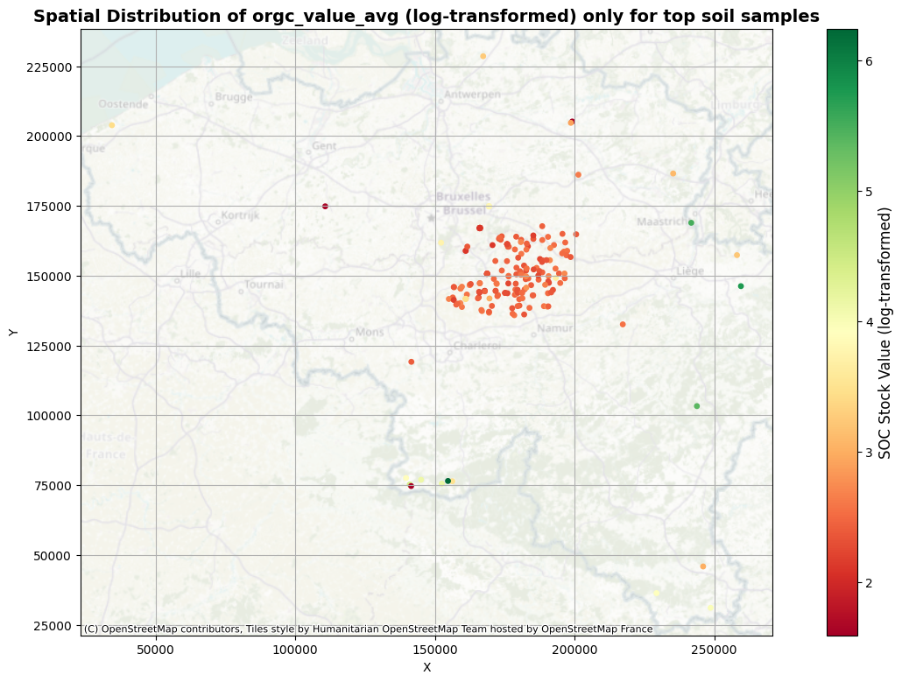

# Seqana Data Engineering Challenge



## Project Directory Structure

```
Seqana-Project/
├── img/
│   └── Spatial_Distribution_of_SOC.png
├── main.py
├── utils/
│   └── utils.py
├── run_project.sh
├── exploratory_data_analysis.ipynb
├── requirements.txt
├── README.md
├── soil_data.db
├── test_sql.py
├── map.html
├── Seqana.sql
└── .gitignore
```

## Setup and Run

1. **Clone the Repository**:
    ```sh
    git clone https://github.com/nafisehkakhani/Seqana_project.git
    cd Seqana_project
    ```

2. **Create and Activate Conda Environment**:
    ```sh
    conda create --name seqana_test_env python=3.8
    conda activate seqana_test_env
    ```

3. **Install Dependencies**:
    ```sh
    pip install -r requirements.txt
    ```

4. **Run the Project**:
    ```sh
    ./run_project.sh <path_to_excel_file>
    ```

## Notes
- Ensure you have `conda` installed and configured on your system.
- Replace `<path_to_excel_file>` with the actual path to your Excel file.
```